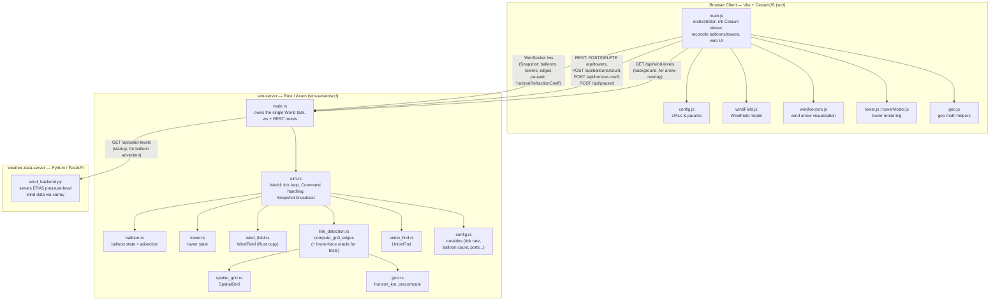

# Architecture

Three processes, started together by `run-all.sh` (see [RUNNING.md](RUNNING.md)):

## Notes

- **sim-server is authoritative.** All balloon physics and radio-link detection
  (`link_detection.rs`, ported from the original `linkDetection.js`) run
  server-side in a single task that owns `World` exclusively — no locks.
  Mutations arrive as `Command`s over an `mpsc` channel; state goes out as
  JSON `Snapshot`s over a `broadcast` channel to every connected client.
- **The browser client is a thin renderer.** `src/main.js` holds no physics
  or link-detection logic; it reconciles Cesium entities against whatever
  `sim-server` broadcasts and forwards user actions as REST commands. It also
  supports click-to-inspect: clicking a balloon selects it and opens an
  inspector panel with its live lat/lon/altitude, refreshed each snapshot.
- **`sim-server` is the sole client of the weather backend.** It fetches the
  wind field once at startup (for advection) and falls back to zero wind if
  `wind_backend.py` isn't running. It holds that field as a shared `Arc` and
  re-serves it over its own `GET /api/wind-levels`, so the browser's
  (arrows-only) copy — slow to transfer, ~55s / 356MB, see
  `WIND_TRANSFER_PERF.md` — comes from `sim-server`, not from Python
  directly. One fetch to Python, one payload in memory.
- **Pause and slider values are broadcast, not local.** A `SetPaused`
  command and `paused` flag on `World` back a `POST /api/paused` endpoint;
  when paused, `World::tick` freezes physics/link recomputation. Both
  `paused` and `horizonRefractionCoeff` are included in every `Snapshot` so
  all connected tabs stay in sync — controls POST the desired value and wait
  for the server to echo it back rather than flipping optimistically.
- **`weather-data-server/get_wind_data.py`** is a separate, older prototype
  script (not part of the running app) — the live backend is `wind_backend.py`.
