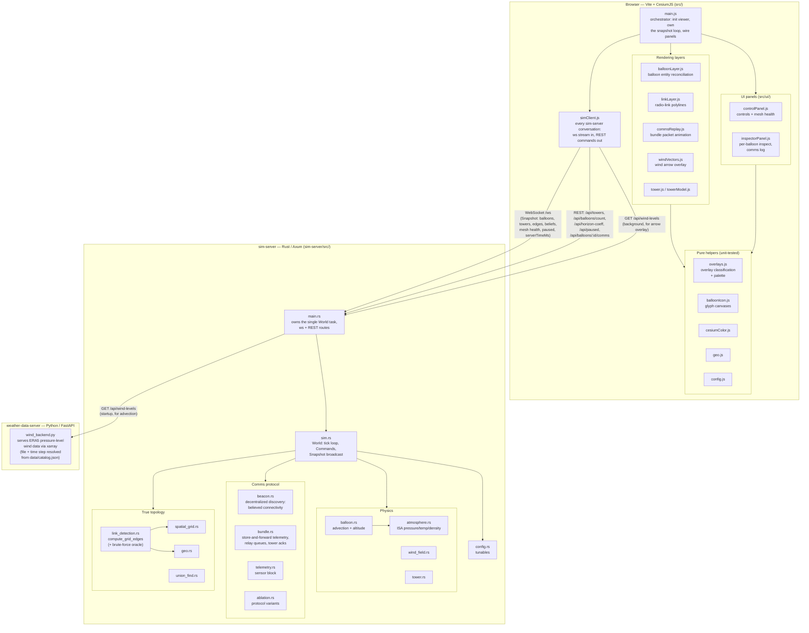

# Architecture

Three processes, started together by `run-all.sh` (see [README.md](README.md#how-to-build-and-run)):

## Notes

- **sim-server is authoritative.** All balloon physics, radio-link detection, and
  the comms protocol run server-side in a single task that owns `World`
  exclusively — no locks. Mutations arrive as `Command`s over an `mpsc` channel;
  state goes out as JSON `Snapshot`s over a `broadcast` channel to every client.

- **The browser is a thin renderer.** It holds no simulation state — it reconciles
  Cesium entities against whatever `sim-server` broadcasts and forwards user
  actions as REST commands. Controls POST a desired value and wait for the server
  to echo it back rather than flipping optimistically, so every connected tab
  stays in sync.

- **Belief and truth are computed separately.** `link_detection.rs` computes the
  true connectivity graph; `beacon.rs` computes what each balloon *believes* it
  can reach, from beacons it actually received. Both ride on every `Snapshot`,
  which is what makes the belief-vs-truth overlay possible. See
  [`docs/design/MESH_COMMS_DESIGN.md`](docs/design/MESH_COMMS_DESIGN.md).

- **Snapshots carry `serverTimeMs`.** A client that falls behind is sent the
  newest snapshot rather than a backlog, and the frontend surfaces its own view
  lag. See [`docs/investigations/`](docs/investigations/) and the `diagnose-lag`
  skill.

- **`sim-server` is the sole client of the weather backend.** It fetches the wind
  field once at startup and falls back to zero wind if `wind_backend.py` isn't
  running. It holds that field as a shared `Arc` and re-serves it over its own
  `GET /api/wind-levels`, so the browser's arrows-only copy — slow to transfer,
  ~55s / 356MB, see
  [`docs/investigations/WIND_TRANSFER_PERF.md`](docs/investigations/WIND_TRANSFER_PERF.md)
  — comes from `sim-server`, not from Python directly.

- **One wind *time step* is served, out of however many the file holds.** The
  ERA5 downloads can cover a full day at hourly resolution, but a single
  stride-2 step is already ~350MB of JSON, so `wind_backend.py` pins one step at
  startup (`WIND_TIME_INDEX`) rather than shipping the span. Which file and step
  is resolved from `weather-data-server/data/catalog.json`, generated by
  `catalog_data.py` — nothing is hardcoded, and `GET /api/wind-levels` carries an
  additive `source` object saying what was resolved. If no data resolves at all,
  Python serves an analytic jet-stream field flagged `synthetic: true` instead of
  refusing to start, because the old failure mode — sim-server silently falling
  to `WindField::zero()` — looked like a physics bug rather than a missing file.

- **Offline experiment binaries** live in `sim-server/src/bin/` and share the
  simulation code through `lib.rs`: `protocol_sweep`, `bundle_delivery`,
  `beacon_convergence`, `mesh_depth`, `connectivity_sweep`, `telemetry_records`,
  and `timing` (which asserts the timing model can't rot). Results land in
  [`experiments/`](experiments/).
