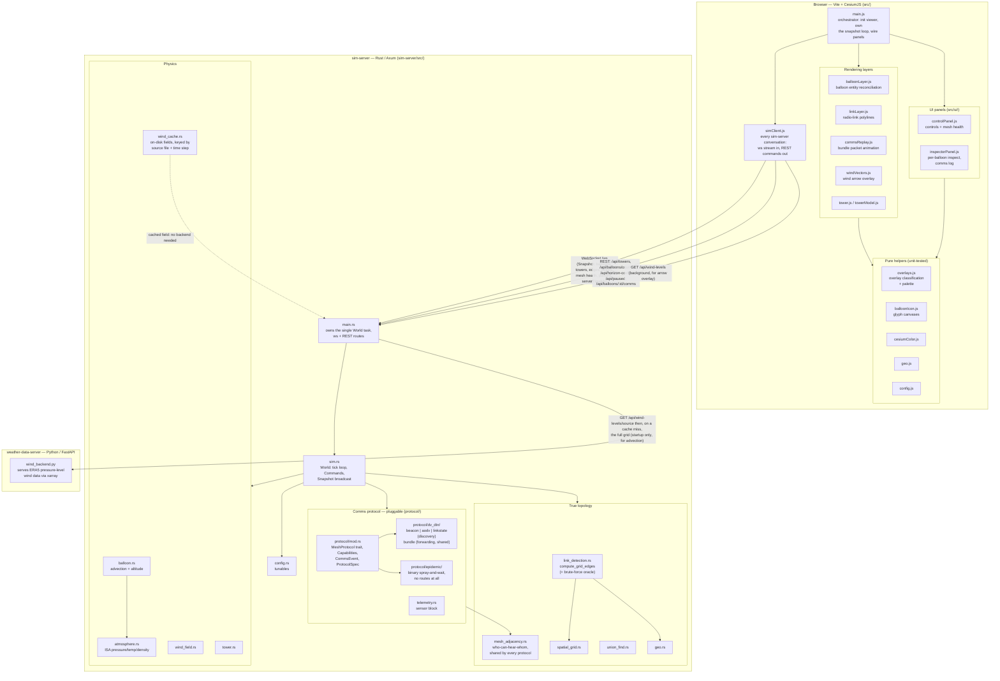

# Architecture

Three processes, started together by `run-all.sh` (see [README.md](README.md#how-to-build-and-run)):

## Notes

- **sim-server is authoritative.** All balloon physics, radio-link detection, and
  the comms protocol run server-side in a single task that owns `World`
  exclusively — no locks. Mutations arrive as `Command`s over an `mpsc` channel;
  state goes out as JSON `Snapshot`s over a `broadcast` channel to every client.

- **The browser is a thin renderer.** It holds no simulation state — it reconciles
  Cesium entities against whatever `sim-server` broadcasts and forwards user
  actions as REST commands. Controls POST a desired value and wait for the server
  to echo it back rather than flipping optimistically, so every connected tab
  stays in sync.

- **Belief and truth are computed separately.** `link_detection.rs` computes the
  true connectivity graph; the running protocol computes what each balloon
  *believes* it can reach, from transmissions it actually received. Both ride on
  every `Snapshot`, which is what makes the belief-vs-truth overlay possible. See
  [`docs/design/MESH_COMMS_DESIGN.md`](docs/design/MESH_COMMS_DESIGN.md).

- **The comms protocol is swappable.** `MeshProtocol` is the seam: a protocol
  owns all of its own per-node state (a balloon carries only physics plus a
  small published view), so a protocol with no routes at all — epidemic — fits
  as naturally as the shipped distance-vector one. Chosen at startup with
  `--protocol`; see
  [`docs/design/PROTOCOL_REFERENCE.md`](docs/design/PROTOCOL_REFERENCE.md) for
  message-flow diagrams of all four and what every parameter is worth, or
  `./run-all.sh --help` for the spec syntax alone. Every `Snapshot` carries a `Capabilities` record so the UI hides
  controls whose underlying concept the running protocol doesn't have, rather
  than showing meaningless values.

- **Wind fields are cached on disk.** `wind_cache.rs` keys a field on its source
  file's *bytes*, time step and stride, so experiments can pin a specific one
  and `sim-server` can start without the Python backend running at all. See
  [`experiments/aggregation-summary.md`](experiments/aggregation-summary.md) for
  why a pinned field matters to the statistics.

- **Snapshots carry `serverTimeMs`.** A client that falls behind is sent the
  newest snapshot rather than a backlog, and the frontend surfaces its own view
  lag. See [`docs/investigations/`](docs/investigations/) and the `diagnose-lag`
  skill.

- **`sim-server` is the sole client of the weather backend.** At startup it asks
  only *which* field the backend would serve — a metadata call — and loads it
  from `wind_cache` on a hit, fetching the full grid only on a miss and caching
  it for next time. With a populated cache the backend need not be running at
  all, which is why `run-all.sh` skips starting it; with neither cache nor
  backend it falls back to zero wind and says so. It holds the field as a shared
  `Arc` and re-serves it over its own
  `GET /api/wind-levels`, so the browser's arrows-only copy comes from
  `sim-server` rather than from Python directly — one fetch of the grid instead
  of two. The payload itself is no longer the bottleneck it was: 146.2MB and
  ~0.04s over HTTP after the rounding and pre-encoding work in
  [`docs/investigations/WIND_TRANSFER_PERF.md`](docs/investigations/WIND_TRANSFER_PERF.md)
  (down from ~356MB / ~55s).

- **Offline experiment binaries** live in `sim-server/src/bin/` and share the
  simulation code through `lib.rs`. Results land in [`experiments/`](experiments/).

  | binary | what it answers |
  |---|---|
  | `protocol_compare` | every protocol over identical balloon fields; takes `--wind` |
  | `wind_sweep` | the above, crossed with several cached weather fields |
  | `aggregation_sweep` | the batching / ack-digest grid, many seeds |
  | `discovery_sweep` | the discovery-mechanism variants (overhearing, expanding ring, MPR, `lsa=`), per-seed CSV |
  | `density_sweep` | every protocol across the balloon-density range, through percolation |
  | `ground_truth_sweep` | grounded-% ground truth over the same density grid, protocol-independent |
  | `link_churn` | does wind actually churn the topology, against a zero-wind control |
  | `wind_cache` | populate and inspect the on-disk wind fields |
  | `protocol_golden` | deterministic fingerprint, diffed across refactors |
  | `bundle_delivery` | delivery under one protocol, with `PREFER_NEARER=1` ablation |
  | `beacon_convergence`, `mesh_depth`, `connectivity_sweep` | discovery and topology statistics |
  | `protocol_sweep`, `batch_sweep`, `telemetry_records` | narrower parameter sweeps |
  | `timing` | asserts the timing model can't rot |
