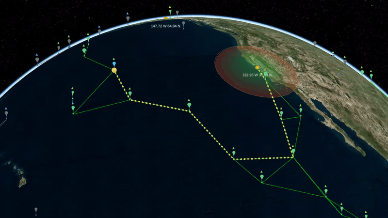

# Zephyrian Mesh

A simulator for a constellation of high-altitude balloons that have to get
their telemetry to the ground without being told how.

Balloons drift on real ERA5 wind fields over a Cesium globe, forming and
losing line-of-sight radio links as they move. Each one generates telemetry
bundles that reach a ground tower only by being carried and relayed through
whatever neighbours happen to be in range.



*One balloon's last bundle, replayed along the path it actually took: out
hop by hop to the tower (yellow), then the ack retracing it home (green).
Globe, imagery and terrain: [CesiumJS](https://cesium.com/platform/cesiumjs/)
and Cesium ion.*

## The constraint

No balloon is handed a picture of the network. A balloon learns who it can
reach from beacons it actually received, and forwards bundles toward the
tower it *believes* it has a route to — a belief that is often stale, and
sometimes wrong. Everything interesting lives in the gap between that belief
and the true connectivity graph, which the simulator computes separately so
the two can be compared.

Explored in [`docs/design/MESH_COMMS_DESIGN.md`](docs/design/MESH_COMMS_DESIGN.md); the
belief-vs-truth divergence is plotted in
[`experiments/protocol-results/`](experiments/protocol-results/).

## Layout

| Piece | What it does |
| --- | --- |
| `sim-server/` | Rust. Physics, link detection, and the pluggable comms protocols — the simulation's source of truth. |
| `src/` | Browser frontend. Renders whatever `sim-server` broadcasts over a WebSocket; holds no simulation state. |
| `weather-data-server/` | Python. Serves ERA5 wind fields to `sim-server`. |
| `experiments/` | Offline sweep binaries and their results. |
| `docs/` | Written-up investigations and protocol diagrams. |

**New to the comms side? Start with
[`docs/design/A-BUNDLES-LIFE.md`](docs/design/A-BUNDLES-LIFE.md)** — one telemetry
record followed from measurement to acknowledgement, with each design decision
named where it bites. It is the on-ramp to everything below.

Then the design notes:
[`docs/design/MESH_COMMS_DESIGN.md`](docs/design/MESH_COMMS_DESIGN.md) (the comms protocol),
[`docs/design/PROTOCOL_REFERENCE.md`](docs/design/PROTOCOL_REFERENCE.md) (all four protocols, diagrammed),
[`docs/design/TIMING_MODEL.md`](docs/design/TIMING_MODEL.md) (every clock in the system, in seconds),
and [`docs/design/BALLOON_PHYSICS_VISION.md`](docs/design/BALLOON_PHYSICS_VISION.md) (where the
buoyancy model is headed).

## User-specific setup

A few things are personal to your machine and deliberately not committed —
each has a template checked into git that you copy and fill in yourself:

| What | Template → your copy | Why it's not just committed |
| --- | --- | --- |
| Cesium Ion access token | `src/user-config-template.json` → `src/user-config.json` | It's a secret credential. |
| Which ERA5 file to serve | `weather-data-server/wind_source_template.json` → `weather-data-server/wind_source.json` | It names *your* downloaded file by its opaque Copernicus hash — nobody else has that exact file. |

Both real files are gitignored; only the `-template` versions are tracked.
Without them: the frontend can't load Cesium's globe imagery/terrain (no
token), and `wind_backend.py` serves a synthetic analytic jet stream instead
of real reanalysis wind (no data file configured) — both fail soft with an
explanatory message rather than crashing.

One more requirement that lives outside the repo entirely: acquiring ERA5
data in the first place needs a Copernicus Climate Data Store API key in
`~/.cdsapirc` — see
[`weather-data-server/README.md`](weather-data-server/README.md#acquiring-your-own-data)
for how to get one. You don't need this at all if you're fine with synthetic
wind.

## How to build and run

Set up your Cesium Ion token first — see
[User-specific setup](#user-specific-setup) above.

The app needs three processes running together: the wind data backend, the
Rust simulation server, and the Vite frontend.

```bash
npm install   # first time only
./run-all.sh
```

`run-all.sh` starts all three in order — waiting for each to be ready
before starting the next, skipping any that's already running — and stops
them together on Ctrl-C. The other two logs go to a temp dir (it prints
where). That's the whole quick start; the rest of this section is the
manual, three-terminal version, useful if you want to see each server's
output live or start just one of them.

```
┌─────────────────┐                          ┌────────────┐              ┌────────────────┐
│ wind_backend.py │─ GET /api/wind-levels ──►│ sim-server │── WS /ws ───►│ browser        │
│ port 8000       │     (once, startup)      │ port 8080  │ (snapshots)  │ localhost:5173 │
└─────────────────┘                          └────────────┘              └────────────────┘
```

### 1. Wind data — `wind_backend.py` (Python, port 8000)

```bash
cd weather-data-server
./run.sh
```

Serves the static ERA5 wind grid as JSON. Start this first — both
`sim-server` and the browser's wind-vector-arrow overlay fetch from it.

`run.sh` uses a minimal venv local to this directory
(`weather-data-server/.venv`), creating it and installing
`requirements.txt` automatically on first run.

Sanity check it's up:

```bash
curl http://127.0.0.1:8000/api/wind-levels/meta
```

### 2. Simulation — `sim-server` (Rust, port 8080)

```bash
cd sim-server
cargo run --release
```

First build takes a minute or so; after that it's fast (cached). Owns
balloon/tower state, physics, and radio-link detection — see
[`sim-server/README.md`](sim-server/README.md) for how it fits together.
Wind is loaded from an on-disk cache when one exists, and fetched from
`wind_backend.py` only on a miss (then cached). So the ~100s that startup
used to spend building and transferring a ~350MB grid is paid once rather
than every run, and `run-all.sh` doesn't start the Python backend at all
once the cache is warm. Choose a field with `--wind` — `auto` (default)
means cache-then-fetch, `none` means zero wind, and anything else names a
cached field by its observation time:

```bash
cd sim-server
cargo run --release --bin wind_cache -- steps   # what the .nc holds
cargo run --release --bin wind_cache -- fetch   # cache it (backend must be up)
cargo run --release --bin wind_cache -- list
```

With neither cache nor backend, `sim-server` logs a warning and falls back
to zero wind rather than failing to start.

Sanity check it's up (should hang open, printing snapshot JSON — Ctrl-C
to stop):

```bash
curl -N http://127.0.0.1:8080/ws
```

### 3. Frontend — Vite dev server (port 5173)

```bash
npm run dev
```

Opens at `http://localhost:5173/`. Globe, balloons, towers, and radio
links typically all appear within about 10 seconds, dominated by
Cesium's terrain load — sim-server seeds balloons/towers fresh on each of
its own restarts, not on frontend reloads, so reloading the browser just
reconnects to whatever state sim-server already has. The "Wind vectors"
toggle stays disabled a bit longer (shows "Loading wind data..."): it
fetches the full wind grid from `sim-server` in the background (which
serves it from whatever field it loaded) — nothing else waits on that
fetch.

### Stopping everything

Ctrl-C in each terminal, or:

```bash
pkill -f "target/release/sim-server"
pkill -f "uvicorn wind_backend"
pkill -f "vite --port"
```

### Common issues

- **Globe loads but no balloons/towers/links ever appear**: check the
  browser console for `sim-server WebSocket error` — `sim-server` isn't
  running or isn't reachable at `SIM_SERVER_WS_URL` (`src/config.js`).
- **Balloons appear but never move / links never form**: `sim-server`
  fell back to zero wind — check its terminal for the
  `failed to fetch wind field ... using zero wind` warning, meaning
  `wind_backend.py` wasn't up when `sim-server` started. Restart
  `sim-server` after confirming `wind_backend.py` is reachable.
- **Port already in use**: another instance is likely still running from
  a previous session — `pgrep -af "sim-server|uvicorn|vite"` to find it.
- **Testing without opening a real browser**: see
  [`.claude/skills/run-cesium-app/SKILL.md`](.claude/skills/run-cesium-app/SKILL.md)
  for a headless Playwright driver (screenshots, JS eval, console capture).

## Verifying radio-link detection

Link detection (spatial grid + radio-range checks) now runs in `sim-server`,
not the browser — the frontend just renders whatever edges it broadcasts.
The correctness check that used to be manual panel buttons
("Verify links now" / debug transient-edge sampling) is now automated:

```bash
cd sim-server && cargo test
```

runs the grid algorithm against an O(n²) brute-force oracle over random
balloon fields (`grid_matches_brute_force_ground_truth` in
`sim-server/src/link_detection.rs`) and asserts they match exactly.

For headless/automated verification of the frontend itself (e.g. from an
agent), see the `.claude/skills/run-cesium-app` skill, which drives the app
in headless Chromium.
## Recording README media

Open the frontend at `http://localhost:5173/?capture` for a fixed 1280×720
globe with the panels hidden. Press `f` to pause the sim and frame an acked
multi-hop bundle, `n`/`p` to try others, `r` to save exactly one replay loop
as a `.webm`, and `s` for a PNG. The key legend is under the globe, and
[`src/captureMode.js`](src/captureMode.js) has the details. Then turn the
recording into a GIF with:

```bash
scripts/readme-gif.sh ~/Downloads/bundle-b347-….webm docs/media/bundle-delivery.gif
```
