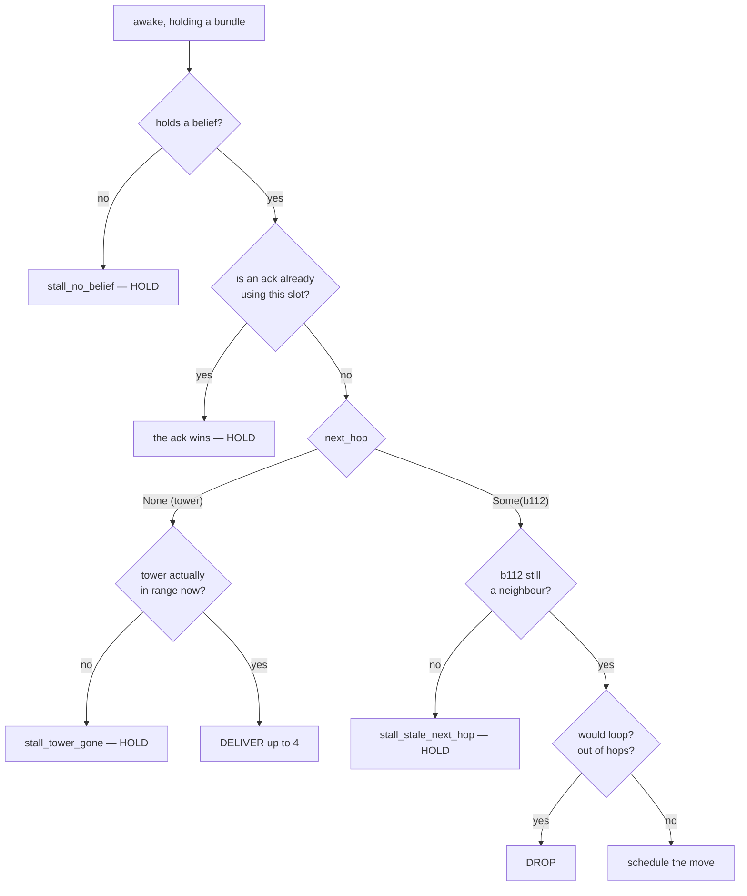

# A bundle's life

*The narrative on-ramp. [`PROTOCOL_REFERENCE.md`](PROTOCOL_REFERENCE.md) tells you
what each parameter does; this tells you the story one telemetry record lives
through, and names each design decision at the moment it bites. Read this first,
then that.*

We follow a single bundle from the instant a balloon measures itself to the
instant its origin finds out what happened — under the shipped protocol,
`dv-dtn` with default parameters. Round numbers are illustrative; every
mechanism, counter and file reference is real.

---

## Vocabulary

`dv-dtn` names its two halves: **dv** is how a route is *found*, **dtn** is how a
bundle is *delivered*. Several terms below are borrowed from real prior art
rather than invented here, and it is worth knowing which — the borrowed ones have
literature behind them, and a few decisions later in this document look
inevitable once you know where they came from.

**From the delay-tolerant networking literature:**

- **DTN** — **Delay-Tolerant Networking** (also *Disruption-Tolerant*). A field
  that grew out of interplanetary networking, where round trips run to minutes or
  hours and there is often **no contemporaneous end-to-end path at all**. That is
  the right frame for a balloon that may simply have to wait for a neighbour to
  drift into range.
- **Bundle** — the unit of transfer. DTN's own term, from the Bundle Protocol
  (RFC 5050, now RFC 9171), not a coinage of this project. Here one bundle
  carries one telemetry record.
- **Store-carry-forward** — the defining DTN behaviour: when there is no usable
  next hop, *hold* rather than drop. A broken path becomes a delay instead of a
  loss. Appears below as the "hold, don't drop" rule, in Acts 3 and 4.
- **Aggregate Custody Signals** — the Bundle Protocol's way of acknowledging many
  deliveries in one message. The ack digest in the final section is closely
  modelled on it.

**Local to this project:**

- **dv** — distance-vector: a hop count plus a next hop, learned from beacons.
- **Belief** — a balloon's current route claim. Deliberately not called a
  "routing table", because the entire point is that it can be wrong.
- **Wake slot** — one balloon, awake, transmitting once. The unit of scarcity,
  and the thing every mechanism here is competing for.
- **Round** — the comms tick. A balloon wakes every 5 of them by default.
- **Tower-adjacent** — a balloon that can hand a bundle straight to a ground
  station. Only ~27 of 1200 at any moment, which is the bottleneck this whole
  document circles.

---

The numbers that set the pace, all from
[`params.rs`](../../sim-server/src/protocol/dv_dtn/params.rs):

| | value | meaning |
|---|---|---|
| `beacon_interval_rounds` | 5 | a balloon wakes to transmit once per 5 rounds |
| `bundle_max_age_rounds` | 150 | a bundle's whole lifetime |
| `relay_queue_capacity` | 8 | how many bundles a balloon may carry |
| `batch.mesh_hop` | 1 | bundles per balloon-to-balloon transmission |
| `batch.tower_contact` | 4 | bundles per tower handoff |

Divide the first two and you get **the single most important number in this
project: 30.** A bundle gets thirty wake slots, ever. Every mechanism below is
competing for them.

---

## Act 0 — before our bundle exists

Towers have been flooding beacons since round 0. A beacon says *"tower 3, this
many hops, emitted at round R"*, and it spreads outward one hop per wake slot.

Our balloon, **b417**, currently believes: *tower 3, 4 hops away, next hop
b112, emitted at round 980.*

Three things about that belief are worth pinning now, because everything later
depends on them.

**It is not knowledge, it is a rumour with a timestamp.** b417 has never seen
tower 3. It heard from b112, who heard from someone else. The `emitted_at_round`
is when the *tower* sent that wave — **not** when b417 heard it, and **not**
when b112 relayed it.

**That distinction is load-bearing, and getting it wrong was a real bug here
twice.** If a relay restamped the field with the current round, stale news would
look fresh. Under freshness-first adoption a stale 12-hop route then beats a
current 2-hop one, routes inflate instead of converging, and beliefs never drain
because every relay renews the lease. The rule is: **relaying never restamps.**
Real AODV solves the same problem with destination sequence numbers; here the
emission round stands in for them.

**It expires on the age of the news, not on when it was last heard.** At
`belief_max_age_rounds = 60`, this belief dies at round 1040 unless a fresher
wave arrives. Keying expiry on "when did I last hear something" is the trap: a
cluster cut off from every tower would keep relaying stale routes to each other
forever and sustain the fiction indefinitely.

So b417 is holding a four-hop route that is 20 rounds old and may already be
wrong. It has no way to tell. **That gap is the subject of this whole
simulator.**

---

## Act 1 — origination (round 1000)

b417 wakes. Bundle work runs in five phases inside
[`bundle::step`](../../sim-server/src/protocol/dv_dtn/bundle.rs#L282), and
origination is *last* — phase 5 — so a balloon never originates into a slot it
could have spent forwarding.

Two independent gates must pass:

- **Queue room.** `queue.len() < 8`. This capacity is shared with other people's
  traffic in transit.
- **Nothing of its own outstanding.** A balloon may have only one of *its own*
  bundles in flight.

> **A design error worth knowing about**, because the fix is the reason there
> are two limits and not one. These were once conflated into a single slot. That
> meant a balloon carrying its own bundle **could not relay anyone else's** —
> the fleet's storage capacity collapsed to almost nothing precisely when it was
> most needed.

Both gates pass, so b417 measures itself once and the reading goes **two
places**:

```rust
let record = TelemetryRecord::sample(&balloons[i], b.bundle_seq, round);
b.log.push_back(record.clone());        // the copy that STAYS
b.queue.push_back(Bundle {              // the copy that TRAVELS
    origin_id: 417, seq: 7,
    created_at_round: 1000,
    record,
    path: vec![417],                    // itself, already
});
b.outstanding = Some(OutstandingBundle { seq: 7, state: AckState::Pending, .. });
```

Three details that pay off much later:

- **`path` starts containing the origin.** It is both the loop detector and, if
  the bundle arrives, the return route for the receipt.
- **`outstanding` is the origin's own view**, and it is deliberately poorer than
  the server's. Right now it says `Pending` — which will turn out to mean less
  than it sounds like.
- **One measurement, two copies, same `seq`**, because they are the same event.

---

## Act 2 — the wait

b417 does not transmit again until round 1005. Nothing happens in between; the
radio is asleep.

This is the constraint everything else is downstream of: **one wake slot is one
transmission.** Not one per round — one per *five* rounds, per balloon. A
four-hop path therefore takes a minimum of four wake slots (~20 rounds) one way,
and that is the *best* case where every balloon along it happens to be awake and
willing at the right moment.

Real high-altitude radios cannot afford to listen continuously; they wake,
transmit, and sleep. If they didn't, every belief would instantly equal ground
truth and there would be nothing to simulate.

**Measured:** a bundle waits a mean of **7.9 rounds** before it moves at all
(`first_hop_latency`) — about 1.6 wake slots, since a balloon may also stall on
the checks in Act 3. Under reactive discovery, where the route has to be
requested before anything can happen, it is **29.9**.

---

## Act 3 — the first hop (round 1005)

b417 wakes with a bundle in hand. Now the gauntlet, in the order the code checks
it ([phase 3](../../sim-server/src/protocol/dv_dtn/bundle.rs#L436)):



Every one of those stalls **burns one of the thirty slots and moves the bundle
nowhere.** That is why `stall_rate` matters more than any loss counter: at a
four-hop depth the bundle needs four *successful* slots out of thirty, and stalls
are what eat the margin.

Three of these deserve names.

**Belief can be stale; the radio cannot lie.** When `next_hop` is `None` the
balloon believes it can hear a tower directly — but the code still checks
`adj.tower_in_range(i)` before handing anything over. Belief is checked against
physics at the moment of use, every time.

**Hold, don't drop.** A stale next hop does *not* destroy the bundle. b417 keeps
carrying it and tries again next slot. This is store-carry-forward — the *dtn*
half of the protocol's name — and it is what makes a broken path a delay rather
than a loss.

**The ack priority rule.** If b417 were relaying somebody's receipt, the receipt
would take this slot and our bundle would wait. That is deliberate, and it costs
throughput — measurably. Acks are *winning* airtime, not merely consuming it,
which is exactly why replacing them with a digest later buys so much.

b112 is still a neighbour, the path doesn't loop, so the move is scheduled.

**Scheduled, not executed** — and the two-phase split matters. If handoffs
applied in place, a bundle could race along several hops within a single round
depending on iteration order, collapsing the very delay being modelled. Subtler
still: the bundle stays in b417's queue until phase 4 actually hands it over, so
a bundle *merely scheduled* to leave still occupies a slot and still counts
against other senders' capacity checks this round.

In phase 4 the handoff lands. `path` becomes `[417, 112]`.

---

## Act 4 — the middle (rounds 1010–1035)

Now our bundle is cargo. b112 carries it, wakes, forwards to b88. b88 carries
it, wakes, and finds its next hop is **full** — eight bundles already.

`blocked += 1`, and **b88 keeps carrying ours.** Hold-don't-drop again, and this
one has the most dramatic evidence behind it in the repo:

> The first version dropped on a full receiver. It destroyed **18,270 of 21,634
> bundles** — congestion alone annihilating 85% of all traffic. Holding turns
> that into delay.

Each failed attempt still costs a slot, though. Our bundle is now four slots
into its thirty.

Two quiet clocks are running the whole time:

- **The belief clock.** b88's route dies at 60 rounds old regardless of what it
  is carrying.
- **The bundle clock.** At 150 rounds our bundle is handed to **satellite** —
  wherever it happens to be sitting, not just at its origin. That is a release
  valve, not a loss: `satellite` counts as *resolved but not delivered*.

---

## Act 5 — the last hop (round 1040)

b31 wakes holding our bundle, believes `next_hop: None`, and tower 3 really is
in range.

**This is where the project's central bottleneck lives.** Of 1200 balloons, only
about **27** can hear a tower at any given moment. Every bundle in the world must
funnel through that population.

So a tower contact is treated as a different kind of event from a beacon:

```rust
let n = params.batch.tower_contact.min(nodes[i].queue.len());  // 4, not 1
```

One-transmission-per-slot is the right rule for a *broadcast beacon* rationed by
a battery. A point-to-point link to a mains-powered ground station with a real
antenna is not that. This single asymmetry is the only lever that acts directly
on the measured bottleneck — and widening it 1 → 4 bought **+16 completion
points**, then saturated, at which point the limit moved back into the mesh.

Our bundle is delivered. `stats.delivered += 1`. Its final `path` is
`[417, 112, 88, 31]`.

**Measured:** delivery takes a mean of **52.6 rounds** from origination, with a
p95 of **138** — most of a bundle's 150-round life. Our 40 is a comfortable trip.
Read that figure carefully, though: it is an average over bundles that *arrived*,
so it says nothing about the ones that didn't.

---

## Act 6 — the receipt

Delivery is not the end, because **the origin still has no idea.**

The tower spawns an ack, source-routed back along the reversed path. It travels
one hop per wake slot, exactly like the bundle, and competes for the same slots —
winning them, per the priority rule.

One detail that catches people: the ack carries the **bundle's**
`created_at_round`, not its own.

```rust
let ack = Ack { created_at_round: bd.created_at_round, .. };
```

So the round trip must complete inside the *same* 150-round budget as the
one-way trip. There is no separate ack timeout. Our bundle used 40 rounds
getting there; the receipt has 110 to get back.

And the ack can simply die — a full `ack_queue` (capacity 4) drops it, counted
as `ack_lost`. Deliberately lossy. Which produces the state this simulator
exists to exhibit:

**A bundle that arrived, and an origin that will never know it.**

Measured under source-routed acks at the shipped settings: **37% of delivered
bundles** are in that band. The origin's `outstanding` sits at `Pending`, then
times out, and b417 concludes its telemetry was lost. It was not. It is on the
ground, in a database, being processed.

**Measured:** for the receipts that do get home, the round trip averages **59.1
rounds** from origination — against 52.6 for the delivery itself. So the last
~6.5 rounds are the balloon waiting to learn something already true. That gap is
what the ack mechanism costs, and it is the smaller half of the story: the
larger half is the 37% for whom the gap never closes at all.

---

## Act 7 — what b417 actually knows

| | server truth | what b417 sees |
|---|---|---|
| delivered? | yes, round 1040, tower 3 | `Pending` → timed out |
| route taken | `[417, 112, 88, 31]` | nothing |
| channel | radio | unknown |

**This asymmetry is the point of the entire project.** Not a limitation of the
simulation — the thing being simulated. The UI is built to show both layers at
once: server truth in the globe's link colours, balloon belief in the tint
overlay, and the gap between them as the interesting signal.

Everything else — four protocols, the aggregation axis, twenty-seed sweeps — is
apparatus for asking *how much* that gap can be closed, and what it costs.

---

## The same bundle under the other protocols

Only **Act 0 and Act 3's routing decision** change. Acts 1, 2, 4, 5, 6 are
byte-for-byte the same code — which is exactly why AODV and link-state live
*inside* `dv_dtn/` as variants rather than as separate protocols. They differ in
~300 lines of discovery and share ~1400 lines of forwarding.

**Reactive (AODV).** Act 0 doesn't happen — no beacons, nothing spent until
there is something to send. So Act 1 is followed by b417 *flooding a request*
and waiting for a reply to walk back, one hop per wake slot **in each
direction**. It usually finds a *shorter* route than proactive (5.7 hops vs 7.1),
and still loses 16 points, entirely to the waiting: `stall_no_belief` runs
23,259 against proactive's 1,118.

**Gossiped link-state.** Balloons broadcast only *observations* — "here is who I
can currently hear" — never a conclusion about distance. b417 assembles its own
partial map and runs its own breadth-first search. It gets excellent routes
(3.2 hops, zero stale next hops, essentially no loops) and **hardly any of
them**, because the map cannot be kept current across 1200 balloons on the
available airtime. Its route freshness is the *minimum* over every observation
on the path — a path is only as current as its stalest link.

This variant can also say something the other two cannot: **"no path exists"**,
as distinct from **"I haven't heard anything lately."** Under distance-vector
those are the same `None` forever.

**Epidemic (spray-and-wait).** Acts 3–5 dissolve. There is no route and no next
hop; the bundle is *replicated* to any neighbour lacking it, with a copy budget
halved at each handoff. It does badly here (23% against 72%) and the counter
says why: `no_candidate` is enormous. A random walk rarely stumbles onto the ~27
balloons that can hear a tower, while dv-dtn steers at them.

That is not a knock on replication — it is this field's premise showing up as a
measurement. Links here are quasi-static (a balloon drifts ~0.4% of link range
per link round), which is precisely the regime where maintaining a route is
cheap and worth it. Replication earns its keep when contacts are brief and a
route cannot be kept current long enough to use.

---

## The two changes that mattered most

Neither is a routing improvement, and that is the finding.

**The ack digest.** Towers announce recent deliveries *inside beacons they were
already sending*. The receipt costs **no additional transmissions at all**, and
one tower broadcast satisfies many origins at once. `ack_lost` goes to zero by
construction, and the "delivered but unacked" band of Act 6 collapses from 37%
to 0%. Worth **+11 points**, mostly by giving back the wake slots acks were
winning.

**Mesh batching.** Raise `batch.mesh_hop` above 1 so a balloon-to-balloon
transmission carries several bundles. Worth **+25 points** — the larger lever.

Together: **72.3% → 95.0%.** They are *substitutes*, not complements — each is
worth less when the other is in place, because both spend the same currency:
wake slots.

**And they cost no time — they save it.** Delivery latency falls **20 rounds**
with both enabled (52.6 → 32.5), p95 falls 138 → 79. That is worth pausing on,
because the obvious expectation is the opposite: batching normally trades latency
for efficiency by waiting for a fuller payload. It doesn't here, because a wake
slot carries whatever is *already queued* and never waits to fill. The queue was
never short of bundles; it was short of slots. Shorten every queue in the mesh
and bundles wait behind fewer other bundles, so delay and delivery improve
together — both were symptoms of the same scarcity.

Which is the lesson to carry out of this document. Route quality was never the
binding constraint. **Information per wake slot** was.

---

## Where to go next

- [`PROTOCOL_REFERENCE.md`](PROTOCOL_REFERENCE.md) — per-protocol diagrams,
  every parameter, measured effect sizes.
- [`MESH_COMMS_DESIGN.md`](MESH_COMMS_DESIGN.md) — how the last-hop bottleneck
  was found, and the investigation that produced these numbers.
- [`../../experiments/aggregation-summary.md`](../../experiments/aggregation-summary.md)
  — the sweeps, including two predictions made in this repo that the
  measurements refuted.
- [`bundle.rs`](../../sim-server/src/protocol/dv_dtn/bundle.rs) — the five
  phases, in order, heavily commented. Acts 1 and 3–6 are all in `step()`.
