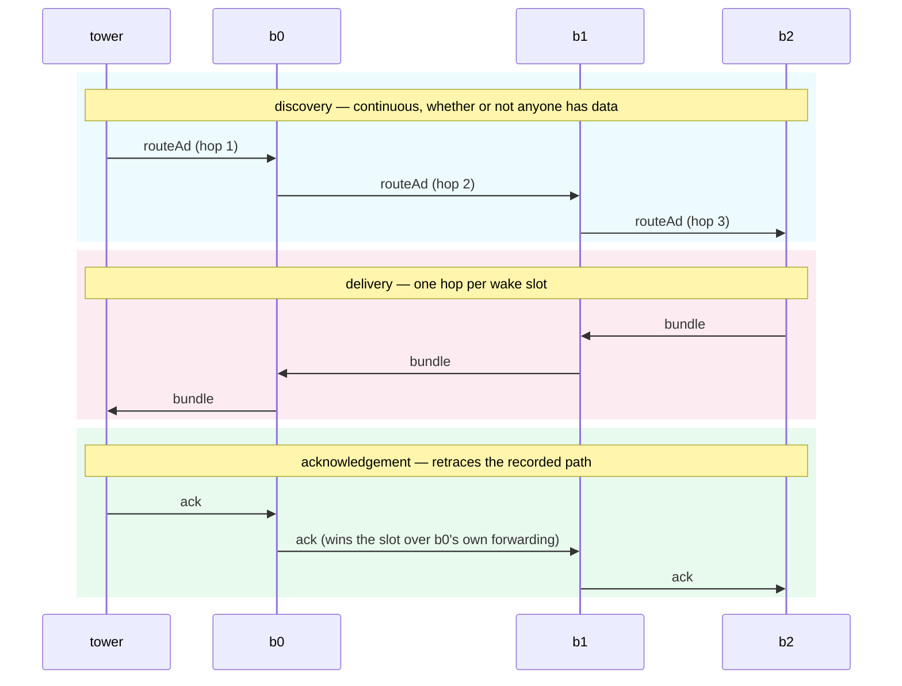
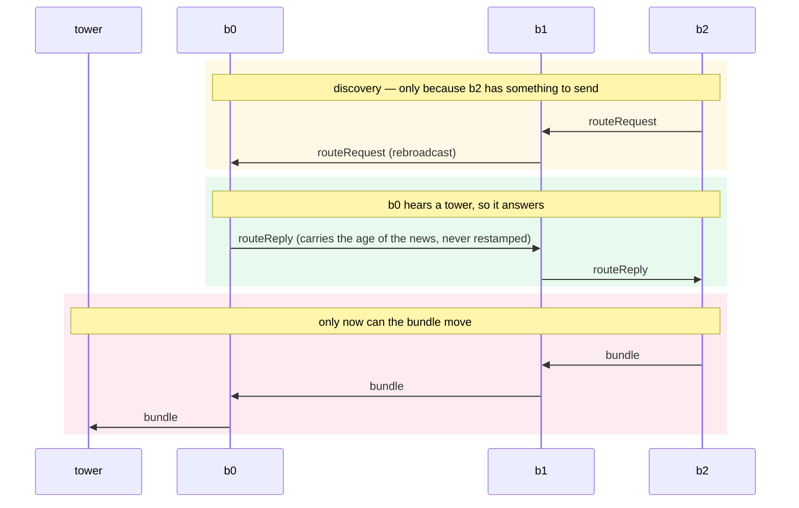
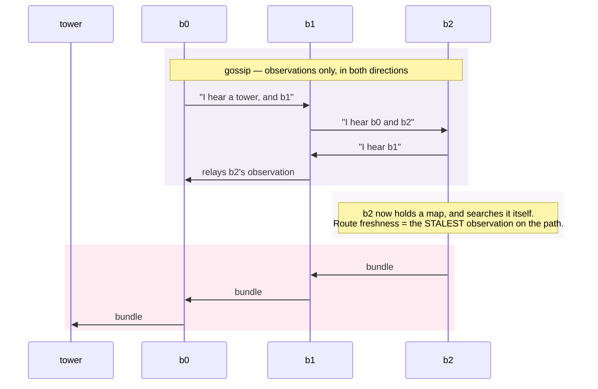
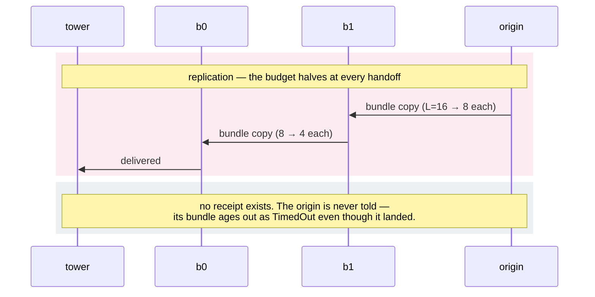
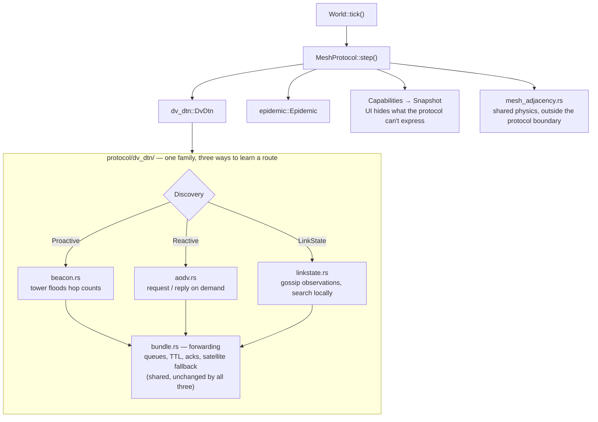

# Mesh comms protocols: what rides in a wake slot

Four protocols are implemented, selectable at startup with `--protocol` (see
`./run-all.sh --help` for the spec syntax). They share one hard constraint: a
balloon's radio is duty-cycled, so **one wake slot is one transmission**.
Everything that separates them is a decision about what to spend that slot on —
and about whether anything is left over to tell a balloon its data got home.

A balloon wakes roughly every `beacon_interval_rounds` (5) rounds. Discovery
traffic, payload, and receipts all compete for the same slots, which is why the
ack policy turns out to affect *delivery* and not just bookkeeping.

Message kinds below use the same names the wire and the frontend use
(`EventKind` in [`protocol/mod.rs`](../../sim-server/src/protocol/mod.rs);
colours in [`src/commsLayer.js`](../../src/commsLayer.js)), so a diagram here
matches the animation on the globe.

**Headline numbers** — completion %, 20 seeds, n = 1200, 400 rounds, zero wind,
from [`wind-sweep-results.csv`](../../experiments/wind-sweep-results.csv):

| protocol | spec | completion |
|---|---|---|
| Distance-vector beacons | `dv-dtn` (default) | 68.9 ± 6.7 |
| …with digest acks + batching | `dv-dtn:ack=digest,mesh=4` | **94.9 ± 2.0** |
| Reactive discovery (AODV-style) | `dv-dtn:discovery=reactive` | 52.6 ± 5.3 |
| Gossiped link-state | `dv-dtn:discovery=link-state` | 48.2 ± 5.4 |
| Binary spray-and-wait | `epidemic:copies=16` | 20.4 ± 3.1 |

The two losing families have since been tuned with the three standard mechanisms
that ought to close the gap — OLSR's multipoint relays, AODV's expanding-ring
search, and learning from replies not addressed to you. Two worked exactly as
specified at the mechanism level; **the ordering did not move.** Per-parameter
figures are in each section below, the full account in
[`aggregation-summary.md`](../../experiments/aggregation-summary.md) Coda 2.

> **Read `completion` with its denominator in mind.** It is
> `delivered / resolved`, so bundles still stranded in a queue when the run ends
> never enter it — which **flatters a protocol that strands bundles**, and
> reactive discovery strands a great many. On `delivered / originated` the same
> table reads 52.3 / 38.4 / 35.5 for proactive / reactive / link-state. The two
> ratios rank reply overhearing oppositely, which is why the discovery sweep
> reports both.

---

## 1. Distance-vector beacons — `dv-dtn` (the default)

Towers flood hop-counted beacons continuously. A balloon that hears one records
a route belief and passes it one hop further on its own wake slot. Bundles walk
back along whatever next hop the holder currently *believes* in — which may be
stale, and may be wrong. Nothing consults the true topology on a balloon's
behalf; that is the point of the exercise.



**Acks: source-routed.** The tower builds a receipt addressed back along the
bundle's own recorded path. It travels one hop per wake slot, and at every
non-tower-adjacent relay **the ack takes the slot ahead of that balloon's own
forwarding**. That priority is deliberate: letting both ride one wake would
double a balloon's per-slot throughput and break the last-hop scarcity §4 of
[`MESH_COMMS_DESIGN.md`](MESH_COMMS_DESIGN.md) measures. Receipts are therefore
not free — they are paid for in deliveries, which is why replacing them raises
delivery rather than merely tidying bookkeeping.

| parameter | default | effect |
|---|---|---|
| `ack=digest` | source-routed | Announce deliveries inside beacons already going out instead of sending receipt packets. **+11.1 ± 1.8 points**, and ack loss to zero by construction. |
| `mesh=N` | 1 | Bundles per balloon-to-balloon hop. The larger lever: **+24.8 ± 3.8 points**. Substitutes with the digest rather than compounding — both buy back the same wake slots. |
| `tower=N` | 4 | Bundles per tower contact. The last-hop cap: only ~27 of 1200 balloons hear a tower at once. Best config reaches **62%** at `tower=1` vs **94%** at `tower=4`. |
| `metric=` | `freshest` | `nearest` prefers fewer hops; helps below percolation and **hurts above it**, which is where the mesh normally sits. |
| `queue=` | `fifo` | `lifo` serves the newest first, so what moves still has TTL budget — at the cost of starving the bottom of the queue. |

---

## 2. Reactive discovery — `dv-dtn:discovery=reactive`

Nothing is spent until a bundle exists. Then the holder floods a request; every
balloon that hears it records a *reverse pointer* and either answers (if it can
already reach a tower) or rebroadcasts. The reply walks back along those
pointers, installing a forward route at each hop.



**Acks: source-routed only.** The digest rides tower beacons, and reactive
discovery sends none — so `discovery=reactive,ack=digest` is **refused when the
spec is parsed**, with an explanatory error. A protocol that quietly stopped
acknowledging would look like a finding rather than a missing mechanism.

**Why it costs ~16 points against proactive:** not route quality. The routes are
*shorter* (5.6 hops vs 7.1), with no loops. It is the waiting.
`stall_no_belief` runs 23,259 against proactive's 1,118 — balloons sitting on a
bundle while a flood makes its way out and back, one hop per wake slot in each
direction.

| parameter | default | effect |
|---|---|---|
| `reply=` | `intermediate` | Any node holding a live route may answer (what AODV does). `reply=tower` restricts answers to nodes that hear a tower directly: worth **~3 points**, and it makes requests travel further. |
| `overhear=` | `off` | `on` lets any neighbour in earshot install a route from a reply addressed to someone else — free, since the radio is a broadcast medium and requests already reach every neighbour. **+3.9 ± 0.4 points of delivered/originated**, a wash on completion. Cuts `stall_no_belief` 65% and satellite fallback 65%; gives some back as loop drops (131 → 679). |
| `ring=` | `max` | `expanding` is AODV's expanding-ring search. **−2.0 ± 0.4 points** — a clean negative. Routes do get shorter (5.9 → 4.5 hops) and loops nearly vanish, but a failed ring costs a full round trip at one hop per wake slot, and `stall_no_belief` rises 24.8k → 31.1k. Expanding ring exists to save airtime; airtime is not what binds here. |

> **Why overhearing does not close the gap.** It solves the waiting problem
> almost completely and replaces it with a smaller one: **opportunistic adoption
> does not produce a globally consistent route set.** An overhearer installs a
> route computed for somebody else, and the transmitter's own path may run back
> through the overhearer. Gating adoption on strict improvement barely helped.
> Closing this needs real destination sequence numbers — the same mechanism the
> laundering bug below points at, and the one remaining gap between this and
> AODV proper.

> **A bug worth remembering.** Reactive first measured 23.2% with a believed
> depth of 13.6 hops. A node answering from its own route was stamping the reply
> with the *current round* rather than the age of the news it held, so under
> freshness-first adoption a stale twelve-hop route beat a current two-hop one.
> Carrying the age through — the same anti-laundering rule the proactive side
> already had — moved it to 57.3% and 5.6 hops. Real AODV closes the same hole
> with destination sequence numbers.

---

## 3. Gossiped link-state — `dv-dtn:discovery=link-state`

Balloons broadcast only *observations* — a neighbour list, and whether a tower
is in range. Never a distance, never a conclusion. Each balloon accumulates a
partial map of the mesh and runs its own breadth-first search over it.



**Acks: source-routed only**, for the same reason as reactive — no tower beacons
exist for a digest to ride on, so the combination is refused up front.

**Excellent routes, hardly any of them.** Believed depth is 3.15 hops against
proactive's 7.12; loop drops 0.5 against 72; stale next hops *exactly zero*. It
loses on coverage, not quality: the map cannot be kept current across 1200
balloons from the airtime available, so most balloons hold an accurate local
picture with no tower in it. This is the textbook link-state scaling limit
arriving as a duty-cycle constraint rather than an asymptotic argument.

Unlike the other two, a link-state node **recomputes from its database and
installs the answer, including installing nothing**. A balloon whose map shows
no path *knows* there is no path — a strictly stronger statement than the
distance-vector variants can make, where "no belief" is indistinguishable from
"heard nothing lately".

| parameter | default | effect |
|---|---|---|
| `lsa=N` | 4 | Observations per transmission — the same information-per-slot lever as `mesh`, applied to discovery. The dominant parameter here: **2 → 41.0%, 4 → 52.3%, 16 → 68.0%, 64 → 71.6%**, at which point it has caught proactive by spending 64 records per slot against a hop count's one number. |
| `relay=` | `flood` | `mpr` is OLSR's multipoint relays: each balloon names the smallest neighbour subset still covering everything two hops out, and only those rebroadcast for it. Cuts redundant gossip by a third at every `lsa` (0.52 → 0.36 at the default) with only **48%** of neighbours relaying, and coverage provably preserved. Worth **+0.6 ± 0.2 points** — real, but a tenth of what the redundancy figure suggests. See below. |

> **Why MPR barely pays, and what that says about the model.** Measuring gossip
> redundancy first — 52% of arriving records teach the receiver nothing at
> `lsa=4` — made MPR look like a large win, and the prediction from that figure
> was +8–10 points. Measured: **+0.64 ± 0.20**.
>
> The argument was that MPR "does not ask for more airtime, it stops spending
> existing airtime on records the receiver already holds." That is true of a real
> radio and false of this simulator: **gossip and bundle forwarding ride the same
> wake slot here, not competing ones**, so freeing gossip capacity frees nothing
> bundle delivery can spend. MPR saves *bytes*; this model charges for *slots*.
>
> The asymmetry generalizes, and it explains the shape of this whole document:
> any mechanism whose benefit is "fewer bytes on the air" is invisible here,
> while any mechanism whose benefit is "more done per wake" is fully counted —
> which is why batching and the ack digest dominate everything else measured.

---

## 4. Binary spray-and-wait — `epidemic`

No routes at all. A bundle starts with a copy budget and each handoff gives half
of it away, so the number of copies stays bounded network-wide. Delivery is
whichever copy happens to drift within earshot of a tower.



**Acks: none.** The protocol declares `acks: false` and means it. An origin's
bundle is left `Pending` until it ages out, so it resolves to **`TimedOut` even
for bundles delivered long ago** — see the comment on `record_outcome` in
[`protocol/epidemic/mod.rs`](../../sim-server/src/protocol/epidemic/mod.rs).
The server records the true outcome; the balloon is simply not part of that
conversation. **100% of successfully delivered telemetry leaves its origin
believing it failed.**

| parameter | default | effect |
|---|---|---|
| `copies=N` | 4 | Starting budget, halved per handoff. **4 → 9.4%, 16 → 20.4%** — but at 3× the handoffs and 340× the blocking, since copies congest the very queues they need. |

---

## Where acks come into play, compared

Acknowledgement is the sharpest axis between these protocols and the one with
least to do with throughput. The question is not "did the data arrive" — the
server always knows — but **does the balloon that sent it ever find out**.

| protocol | mechanism | acks lost | delivered but unacked |
|---|---|---|---|
| `dv-dtn` source-routed | receipt packet, reverse path | 400 | 37.1% |
| `dv-dtn` digest | announced in tower beacons | **0** | 10.3% † |
| `dv-dtn` reactive | receipt packet, reverse path | 191 | 26.4% |
| `dv-dtn` link-state | receipt packet, reverse path | 86 | 14.5% |
| `epidemic` | none exists | — | **100%** |

20 seeds, zero wind, 400 rounds, n = 1200.

† The digest loses **no** acks — that column is zero by construction, since no
ack packet exists to lose. The residual 10.3% is digests still propagating
outward when the run ended; over 800 rounds it reaches 0.0%.

### Batching makes source-routed acks strictly worse

More bundles land, so more receipts contend for the same slots. Share of
*delivered* bundles whose receipt never got home (24 seeds, n = 1200,
`tower=4`, 800 rounds):

| acks | mesh=1 | mesh=2 | mesh=4 | mesh=8 |
|---|---|---|---|---|
| source-routed | 35.1% | 46.5% | 53.5% | **55.3%** |
| digest | 0.0% | 0.0% | 0.0% | 0.0% |

At `mesh=8` a clear majority of successfully delivered telemetry leaves its
origin believing it failed. The digest removes this by construction, and the
zeros carry no variance because it is not a measured effect but a structural
one.

**For the project's central theme this matters more than the throughput
numbers.** The belief-vs-truth gap is usually shown as stale routes; here it is
a balloon that *did* get its data home and has no way to know. Tuning for
throughput alone would have widened that gap while making the delivery figures
look better.

---

## Under real weather

Real ERA5 wind raises link turnover 4.1× (half-life 757 → 184 rounds) at
unchanged mean degree, and dv-dtn's `stall_stale_next_hop` rises 4.7× in
agreement. Delivery barely moves: compared within every (wind, seed) cell,
dv-dtn beats spray-and-wait L=16 in **160 of 160 cells**, narrowest margin +38.0
points.

| protocol | Δ vs zero wind |
|---|---|
| `dv-dtn` | +1.3 ± 1.6 |
| `dv-dtn:ack=digest,mesh=4` | **−2.0 ± 0.5** |
| `dv-dtn:discovery=reactive` | −2.4 ± 1.3 |
| `dv-dtn:discovery=link-state` | +0.2 ± 1.3 |
| `epidemic:copies=16` | +1.4 ± 0.7 |

Store-carry-forward absorbs churn as **delay** — a balloon whose next hop
vanished keeps carrying the bundle and forwards it later by another route. Only
one row moves outside two standard errors, and it is the best one: **delay is
free only when there is slack**. At 95% completion queues drain instead of
backing up, so a bundle that loses its route rides to TTL expiry rather than
waiting in a queue that was going to be slow anyway.

Full analysis, including the variance decomposition showing weather matters ~10×
less than which balloon field you drew:
[`experiments/aggregation-summary.md`](../../experiments/aggregation-summary.md).

---

## How a protocol plugs in

`MeshProtocol` is the seam. A protocol owns all of its own per-node state — a
`Balloon` carries physics plus a small published view and nothing else — which
is why a protocol with no routes at all fits as naturally as the shipped one.



All three discovery modes install a plain `RouteBelief` with a next hop, which
is why `bundle.rs` needed no changes to support any of them: a route is a route,
however it was found. Epidemic has no such thing, and declares
`route_belief: false` — so the belief overlay and comms replay disappear from
the UI rather than showing meaningless values.

**Reproducing anything above:**

```bash
cd sim-server
./target/release/protocol_compare 20 1200 400          # all protocols, zero wind
./target/release/protocol_compare --wind <label> 20 1200 400
RAYON_NUM_THREADS=2 ./target/release/wind_sweep 20 400 # crossed with weather
python3 ../experiments/summarize_wind.py ../experiments/wind-sweep-results.csv
```
