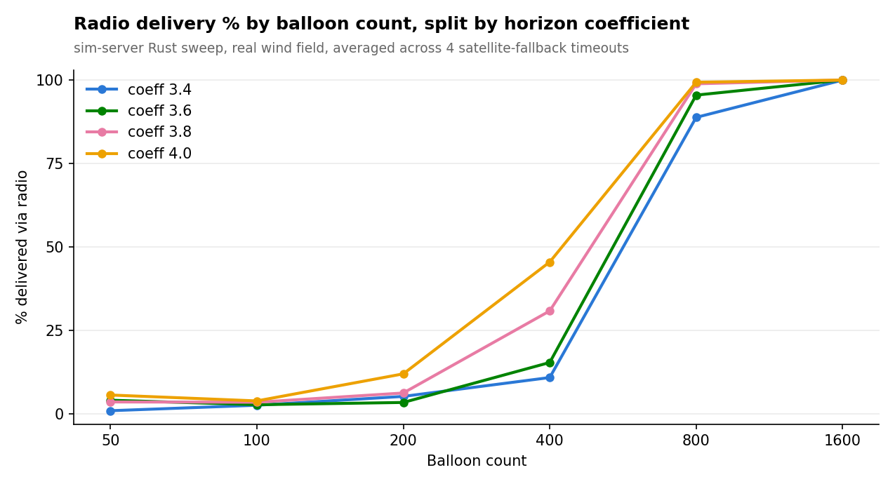
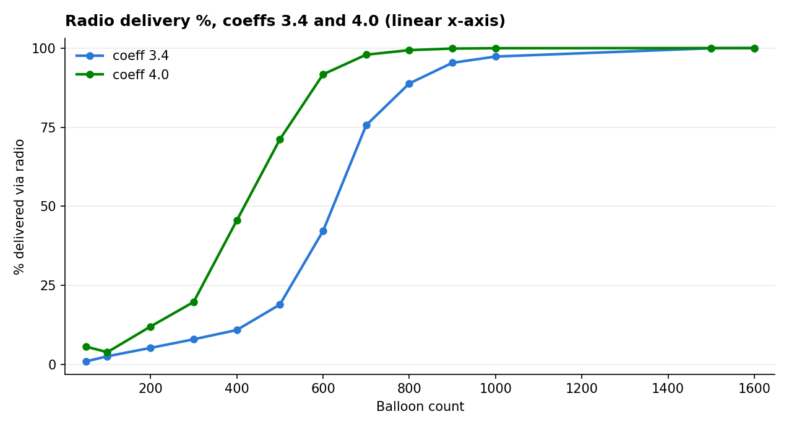

# Radio vs. satellite connectivity sweep — Rust results (real wind)

**Chart (full grid, all 4 coefficients):** [`results-rust/sweep-chart.html`](results-rust/sweep-chart.html) (interactive) / [`results-rust/sweep-chart.png`](results-rust/sweep-chart.png)
**Chart (transition-zone, coeff 3.4 & 4.0 only, linear x-axis):** [`results-rust/sweep-chart-transition-linear-x.png`](results-rust/sweep-chart-transition-linear-x.png)
**Data:** [`connectivity-sweep-results-rust.csv`](connectivity-sweep-results-rust.csv) (116 rows)
**Generator:** [`connectivity_sweep`](../sim-server/src/bin/connectivity_sweep.rs) (`connectivity_sweep full experiments/sweep-config-full-grid.json` for the full grid, `connectivity_sweep full experiments/sweep-config.json` for the transition-zone sub-sweep, to reproduce) · charts rendered with [`plot_sweep.py`](plot_sweep.py)

## What was measured

- **Full grid (96 combos):** horizon coeff 3.4/3.6/3.8/4.0 × balloon count
  50/100/200/400/800/1600 × satellite-fallback timeout 10/20/30/60 min.
- **Transition-zone sub-sweep (+20 new combos):** horizon coeff **3.4 and 4.0
  only** × balloon count **500/600/700/900/1000** (1000-balloon step, filling
  the gap between the full grid's 400 and 800) × satellite-fallback timeout
  **10 and 60 min only**. Coeff 3.6/3.8 were not re-run at this density.
- 116 unique combos total (4 of the sub-sweep's combos land exactly on
  existing full-grid points at n=800 and reproduce them, since results are
  seeded deterministically per combo).

Fixed: 30-second continuous-connection ack duration, 5-simulated-minute payload
cadence, 24 simulated hours per combo. This run used the live wind field from
wind_backend.py (confirmed in every shard log) — balloons drift laterally as
well as in altitude, closer to the live app's actual behavior than a
zero-wind motion model.

## Headline finding: a phase transition, resolved in detail

| Balloon count | Avg. % delivered via radio |
|---|---|
| 50 | 3.6% |
| 100 | 3.2% |
| 200 | 6.8% |
| 400 | 25.7% |
| 500 | 45.1% |
| 600 | 66.9% |
| 700 | 86.8% |
| 800 | 95.6% |
| 900 | 97.6% |
| 1000 | 98.6% |
| 1600 | 100.0% |

(500–1000 are averaged over coeff 3.4/4.0 × 10/60-min timeout only — see the
sub-sweep note above; the other rows are averaged over the full 4-coefficient
× 4-timeout grid.) The added points confirm the mesh doesn't jump straight
from ~26% to ~96% between 400 and 800 balloons — it climbs in a fairly steep
but continuous curve through the 500–700 range, crossing 50% around n≈550 and
80% around n≈680.

## Horizon coefficient and timeout

These are computed on the **original 6-point grid only** (50–1600, all 4
coefficients, all 4 timeouts), so the comparison across coefficients stays
apples-to-apples — the denser 500–1000 sub-sweep only covers coeff 3.4/4.0 and
would otherwise skew their averages upward relative to 3.6/3.8:

- **Horizon coefficient**: 34.8% (coeff 3.4) → 44.4% (coeff 4.0) average — a
  real, consistent effect.
- **Satellite-fallback timeout** barely matters on average: 38.6% (10 min) vs.
  40.1% (60 min).
- The transition zone is where parameter choice matters most: at 400
  balloons, radio delivery ranges from **5.9%** (coeff 3.6, 20-min timeout) to
  **57.9%** (coeff 4.0, 30-min timeout) — a wide spread, consistent with
  wind-driven drift adding variance exactly where the network is balanced on
  the edge of connectivity.

## Zooming in: coeff 3.4 vs. 4.0 across the transition zone

The sub-sweep isolates how much horizon coefficient alone shifts the
percolation curve, at 100-balloon resolution. Plotting balloon count on a
true linear (rather than evenly-spaced-category) x-axis shows the climb is
concentrated in a fairly narrow band of the range swept, not spread evenly
across it:

| Balloon count | Coeff 3.4 | Coeff 4.0 | Gap |
|---|---|---|---|
| 400 | 25.7% | 45.5% | 19.8 pts |
| 500 | 19.0% | 71.2% | 52.2 pts |
| 600 | 42.2% | 91.7% | 49.5 pts |
| 700 | 75.6% | 97.9% | 22.3 pts |
| 800 | 88.8% | 99.3% | 10.5 pts |
| 900 | 95.4% | 99.8% | 4.4 pts |
| 1000 | 97.3% | 100.0% | 2.7 pts |
| 1600 | 100.0% | 100.0% | 0.0 pts |

The gap between coefficients isn't constant across the transition — it peaks
around 500–600 balloons (coeff 4.0 already past 90% while 3.4 is still under
half) and collapses at both ends, since there's little room for a coefficient
effect once either curve is pinned near 0% or 100%. Coeff 4.0 crosses the 50%
mark around n≈480; coeff 3.4 doesn't cross it until n≈580 — a roughly
100-balloon rightward shift in the percolation threshold from lowering the
horizon coefficient alone.

## Practical takeaway

**Balloon density is the lever that matters.** The transition isn't a cliff
between 400 and 800 — it's a climb that crosses 50% around n≈550–600 and is
mostly saturated (>95%) by n≈900, largely independent of horizon coefficient
or timeout tuning once past that point. Below ~500 balloons, no amount of
parameter tuning fully compensates; horizon coefficient has its largest
practical effect (tens of points) in exactly the 500–700 range where the
network is already on the edge, and almost none once density alone has pushed
delivery near 0% or 100%. Real wind doesn't change the shape of the result —
lateral drift adds variance in the transition zone, which is what you'd
expect from adding a source of movement to a network that's already right at
its percolation threshold.

## Limitations

- **1 random seed per combination**, not averaged over repeats — the
  phase-transition pattern (a few percent below the threshold vs. 90%+ above
  it) is well clear of seed-to-seed noise, but individual transition-zone
  cells shouldn't be over-interpreted.
- **The 500–1000 sub-sweep only covers coeff 3.4/4.0 and timeout 10/60 min**,
  not the full 4×4 grid — it was added specifically to resolve the shape of
  the percolation curve, not to extend the coefficient/timeout comparison.
  Coeff 3.6/3.8 and timeout 20/30 min are only characterized at the original
  50/100/200/400/800/1600 resolution.
- **Ack duration fixed at 30s**, not swept — recomputing links every
  simulated second, unthrottled, is already the dominant compute cost (see
  the [`ConnectivityScratch` optimization](../sim-server/src/link_detection.rs)
  that made a full sweep practical to run at all).
- **Real wind, one snapshot.** The wind field is a single static ERA5 time
  snapshot (see the `wind_backend_perf` note) reused for the full 24
  simulated hours — it's real spatial wind structure, not a real time-varying
  forecast, so "closer to the live app" refers to the motion model, not to
  simulating actual weather evolution.
